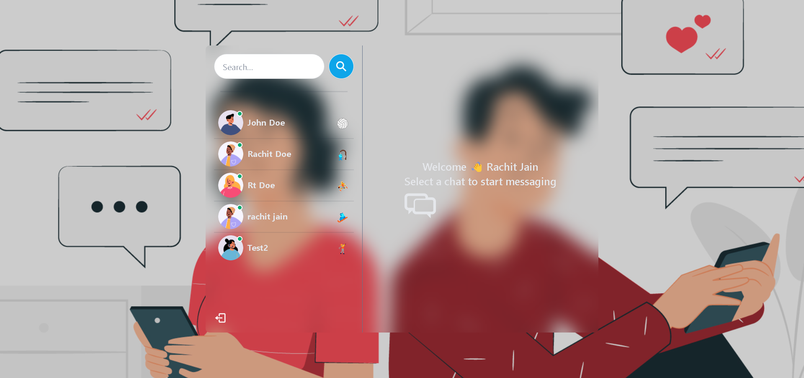
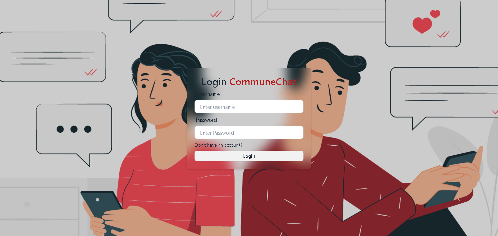

# Chat Application



## Overview
A real-time chat application built using the MERN (MongoDB, Express.js, React.js, Node.js) stack and Socket.IO. This application allows users to communicate with each other instantly in a seamless and interactive interface.

## Features
- Real-time messaging with Socket.IO
- User authentication and authorization
- Create and join chat rooms
- Store messages in MongoDB
- RESTful API for user and message management

## Tech Stack
- **Frontend:** React.js, HTML, CSS
- **Backend:** Node.js, Express.js
- **Database:** MongoDB
- **Real-time Communication:** Socket.IO

## Installation
1. Clone the repository:
    ```sh
    git clone https://github.com/rachit-31/chat-application.git
    cd chat-application
    ```

2. Install server dependencies:
    ```sh
    cd server
    npm install
    ```

3. Install client dependencies:
    ```sh
    cd  client
    npm install
    ```

## Usage
1. Start the server:
    ```sh
    cd server
    npm run server
    ```

2. Start the client:
    ```sh
    cd  client
    npm run dev
    ```

3. Open your browser and go to `http://localhost:3000`.

## Screenshots
### Login Page


### Chat Room


## Acknowledgments
- [Socket.IO](https://socket.io/)
- [MERN Stack](https://www.mongodb.com/mern-stack)
- Thanks to all the open-source libraries used in this project.
